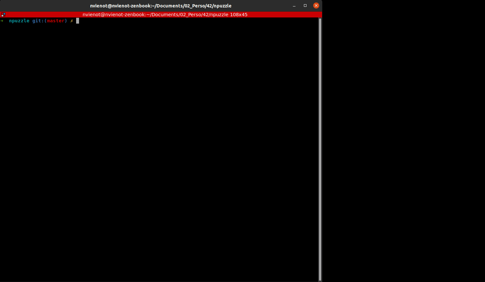

# n-puzzle

<!-- ALL-CONTRIBUTORS-BADGE:START - Do not remove or modify this section -->

<!-- ALL-CONTRIBUTORS-BADGE:END -->

Solving N-puzzle game using Rust and IDA* algorithm

## Demo 💻

 

## Run 🚀

``cargo run --release -- [args]``

## Build ⚙️

``cargo build --release``

``./target/release/npuzzle [args]``

## Contributors ✨

Thanks goes to these wonderful people ([emoji key](https://allcontributors.org/docs/en/emoji-key)):

<!-- ALL-CONTRIBUTORS-LIST:START - Do not remove or modify this section -->
<!-- prettier-ignore-start -->
<!-- markdownlint-disable -->
<table>
  <tr>
    <td align="center"><a href="https://github.com/sgalasso42"> <b>Simon Galasso</b></a> <a href="#infra-sgalasso42" title="Infrastructure (Hosting, Build-Tools, etc)">🚇</a> <a href="https://github.com/nicolasvienot/n-puzzle/commits?author=sgalasso42" title="Code">💻</a></td>
    <td align="center"><a href="https://fr.linkedin.com/in/nicolasvienot"> <b>Nicolas Viénot</b></a> <a href="#infra-nicolasvienot" title="Infrastructure (Hosting, Build-Tools, etc)">🚇</a> <a href="https://github.com/nicolasvienot/n-puzzle/commits?author=nicolasvienot" title="Code">💻</a></td>
  </tr>
</table>

<!-- markdownlint-enable -->
<!-- prettier-ignore-end -->
<!-- ALL-CONTRIBUTORS-LIST:END -->

This project follows the [all-contributors](https://github.com/all-contributors/all-contributors) specification. Contributions of any kind welcome!
